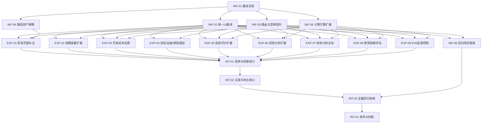

# 迁移编排图（Topology + Parallelism）

## Mermaid DAG

## 并行批次建议（Topological Waves）
- Wave-0：`INF-01`
- Wave-1（可并行）：`INF-02`、`INF-03`、`INF-04`、`INF-05`
- Wave-2（可并行）：`INF-06`、`EXP-01`、`EXP-02`、`EXP-03`、`EXP-04`、`EXP-05`、`EXP-06`、`EXP-07`、`EXP-08`、`EXP-09`
- Wave-3：`INT-01`
- Wave-4：`INT-02`
- Wave-5：`INT-03`
- Wave-6：`INT-04`

## 关键拓扑关系
- `INF-03`（路由/菜单契约）是所有实验任务可集成的前置。
- `INF-05`（计算引擎扩展）是财务与评估类实验的核心前置。
- `INT-01` 必须等待全部 EXP 任务完成后统一收口，避免菜单反复改动冲突。
- `INT-03` 依赖 `INF-06` 的测试框架与 `INT-02` 的功能收口结果。
