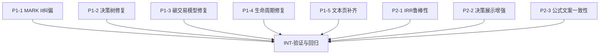

# 实验参考资料对照与正确性修复清单

## 目标
- 基于权威参考资料（标准/官方文档/教材）修正当前实验实现中的算法偏差与功能缺口。
- 输出可直接分配给子 agent 的任务清单（含依赖、验收样例、并行关系）。

## 判定时间
- 基线时间：2026-02-16

## 优先级定义
- `P1`：算法或模型错误，导致结果不可信或与标准明显不一致。
- `P2`：实现过于简化、缺少关键校验、易误导。
- `P3`：展示/可用性增强，不阻断主功能正确性。

## P1 修复项（先做）

### P1-1 MARK II 模型纠偏（当前实现与 Mk II 标准不一致）
- 文件：
  - `src/lib/calc/markii.ts`
  - `src/pages/exp1/markii/index.tsx`
- 当前问题：
  - 使用 `ILF/EIF/EI/EO/EQ` + 复杂度权重（更接近 IFPUG 风格），不是 Mk II 核心计量口径。
- 修复动作：
  1. 按 ISO/IEC 20968 的 Mk II 口径重建数据结构（按 logical transaction 相关参数计量）。
  2. 页面输入项改为 Mk II 所需字段，移除 IFPUG 术语混用。
  3. 输出中明确“原始计量值 + 调整后计量值（若课程采用调整因子）”。
- 验收样例：
  - 用 1 组教材/课程给定样例手算与页面结果对齐（误差 `<= 0.01`）。
  - 不再出现 `ILF/EIF` 术语作为 Mk II 主字段。

### P1-2 决策树 ENPV 计算修复（概率与贴现链路）
- 文件：
  - `src/lib/calc/decisiontree.ts`
  - `src/pages/exp10/decisiontree/index.tsx`
- 当前问题：
  - chance 节点计算读取 `child.probability`，而页面概率配置在 chance 节点自身，概率常被错误回退为等概率。
  - 贴现处理不是按现金流时点一致计算。
- 修复动作：
  1. 统一概率语义：chance 节点概率在“进入该节点的边”或“该节点权重”，前后端一致。
  2. ENPV 使用标准期望贴现：`ENPV = Σ(路径概率 × 路径净现金流现值)`。
  3. 补 3 组测试：等概率、非等概率、含负收益路径（风险概率校验）。
- 验收样例：
  - 页面默认示例概率 `0.4/0.4/0.2` 下，ENPV 与手算一致。
  - 修改概率后结果应单调响应，不能“无变化”。

### P1-3 碳交易拍卖机制改为统一出清价模型
- 文件：
  - `src/lib/calc/carbon.ts`
  - `src/pages/exp6/tanpaifang/index.tsx`
- 当前问题：
  - 当前卖方/买方“逐参与方二价”逻辑与主流 ETS 拍卖机制（统一出清价）不一致。
- 修复动作：
  1. 实现统一出清价双向撮合（或课程指定模型），保留供需曲线交点逻辑。
  2. 页面文案从“Vickrey”改为与实现一致的机制描述。
  3. 增加“成交价、成交量、边际中标方”解释字段。
- 验收样例：
  - 构造 3 买 3 卖样例，手工撮合价量与程序结果一致。
  - 调高最高买价时，成交量不应下降（其他条件不变）。

### P1-4 生命周期成本模型修复（O&M 现值与等值年成本）
- 文件：
  - `src/pages/exp7/shengmingzhouqi/index.tsx`
- 当前问题：
  - O&M 的现值/年值处理链路与标准“先求 PW 再转 AE”存在偏差风险。
- 修复动作：
  1. 按候选寿命 `n` 计算：`PW_OM(n)=Σ OM_t/(1+i)^t`，`AE_OM(n)=PW_OM(n)*(A/P,i,n)`。
  2. 总年等值成本：`AE_total(n)=CR(n)+AE_OM(n)`。
  3. 最优寿命取 `AE_total` 最小值对应 `n`。
- 验收样例：
  - 提供 1 组固定 `P/F/OM` 输入，和 Excel 手算结果逐列比对（`CR`, `PW_OM`, `AE_OM`, `AE_total`）。

### P1-5 21 个“文本页”补齐为可计算实验（功能完整性）
- 文件（当前仅说明+心得）：
  - `src/pages/exp1/gb11/index.tsx`
  - `src/pages/exp1/ifpug/index.tsx`
  - `src/pages/exp1/nesma/index.tsx`
  - `src/pages/exp2/gb21/index.tsx`
  - `src/pages/exp2/leibi/index.tsx`
  - `src/pages/exp2/leitui/index.tsx`
  - `src/pages/exp2/minjie/index.tsx`
  - `src/pages/exp2/xinxihuapinggu/index.tsx`
  - `src/pages/exp3/gb31/index.tsx`
  - `src/pages/exp4/gb41/index.tsx`
  - `src/pages/exp7/chongzhiqi/index.tsx`
  - `src/pages/exp8/boyi/index.tsx`
  - `src/pages/exp8/qiwangjingxianzhi/index.tsx`
  - `src/pages/exp10/jianhuajisuan/index.tsx`
  - `src/pages/exp10/yingli/index.tsx`
  - `src/pages/exp10/changzhai/index.tsx`
  - `src/pages/exp10/shengcun/index.tsx`
  - `src/pages/exp11/fenxiyupingjia/index.tsx`
  - `src/pages/exp12/xiaoyi/index.tsx`
  - `src/pages/exp13/xiaoguo/index.tsx`
  - `src/pages/exp14/eva/index.tsx`
- 修复动作（统一模板）：
  1. 增加“输入参数区 + 公式区 + 计算结果区 + 图表/判定区”。
  2. 抽象计算到 `src/lib/calc/*` 并补单测。
  3. 每页至少 1 组“教材可复核样例”。
- 验收样例：
  - 每个实验都能输入、计算、导出，且有明确数值输出与结论。

## P2 修复项

### P2-1 IRR 求解鲁棒性增强
- 文件：
  - `src/lib/calc/financial.ts`
- 动作：
  - 增加区间搜索/多根提示；无有效根时返回带原因状态（而非仅 `null`）。
- 验收：
  - 常见现金流样例返回与 Excel IRR 接近值（容差 `1e-4`）。

### P2-2 决策方法展示增强
- 文件：
  - `src/pages/exp9/buqueding/index.tsx`
  - `src/lib/calc/decision.ts`
- 动作：
  - 显示每个方法的中间值（各方案最小值、最大值、遗憾值），避免“只给结论”。

### P2-3 公式与文案一致性审计
- 文件：
  - `src/components/ui/formula.tsx`
  - `src/pages/exp*/**/index.tsx`
- 动作：
  - 统一 LaTeX 规范（乘号、上下标、百分号转义）；清理“公式写法与代码计算不一致”项。

## 可并行编排图（建议）

## 子 Agent 分工建议
- Agent-A（金融与投资）：`P1-2`、`P1-4`、`P2-1`
- Agent-B（功能点与规模度量）：`P1-1` + `gb11/ifpug/nesma/gb21/gb31/gb41`
- Agent-C（风险与市场机制）：`P1-3`、`P2-2`
- Agent-D（批量页面落地）：`P1-5` 其余 15+ 文本页补齐
- Agent-E（集成与QA）：`P2-3` + 全量回归/导出验证

## 统一验收门禁
1. `bun run build` 通过
2. `bun test --bail` 通过
3. 每个新增计算页至少 1 组“输入 -> 输出”可复核样例
4. 导出 PDF 可读（无白底白字、无公式渲染残片）
5. 菜单可达，路由无 404

## 参考资料（用于实现对齐）
- COSMIC：<https://cosmic-sizing.org/>
- ISO/IEC 20926（IFPUG）：<https://www.iso.org/standard/51717.html>
- ISO/IEC 20968（Mk II）：<https://www.iso.org/standard/35603.html>
- NESMA：<https://nesma.org/publications/documents/nesma-standard/>
- GB/T 标准检索：<https://openstd.samr.gov.cn/>
- NPV/IRR（Microsoft）：<https://support.microsoft.com/en-us/office/irr-function-b3bacbb0-3af8-494d-9863-d420062273fd>
- Break-even（OpenStax）：<https://openstax.org/books/principles-managerial-accounting/pages/3-2-calculate-a-break-even-point-in-units-and-dollars>
- NASA EVM 指南：<https://ntrs.nasa.gov/archive/nasa/casi.ntrs.nasa.gov/20180001499.pdf>
- RGGI / California ETS 拍卖资料：<https://www.rggi.org/> , <https://ww2.arb.ca.gov/our-work/programs/cap-and-trade-program>
